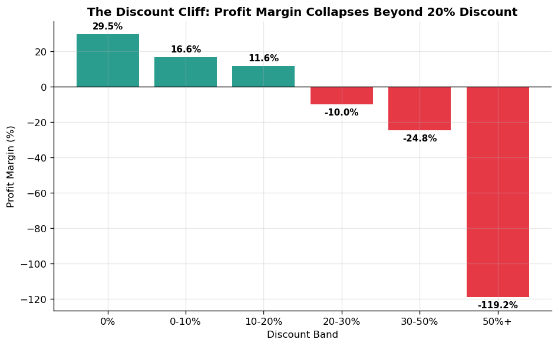
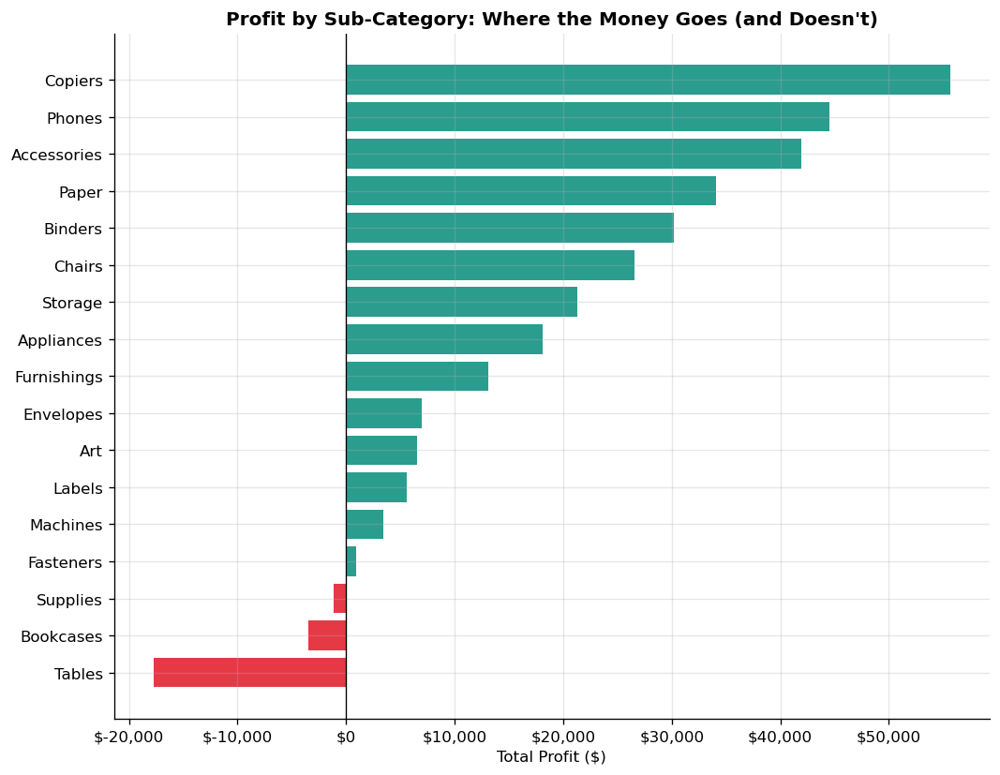
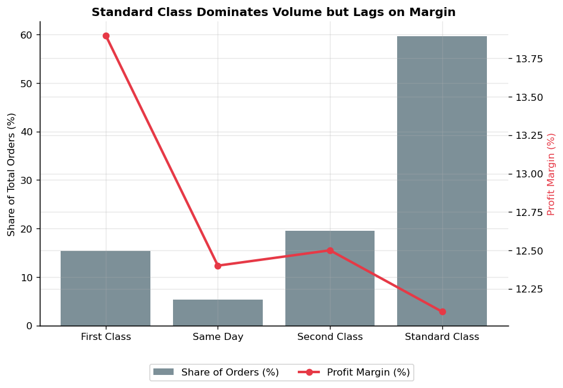

# CORPORATE STRATEGIC MEMORANDUM

TO: Executive Leadership Team / Operational Stakeholders

FROM: Pranav M S Krishnan

DATE: June 12, 2026

**SUBJECT**: **Revenue Optimization & Profit Leakage Mitigation Strategy (FY14–FY17 Historical Audit)**


## Executive Summary
A comprehensive transactional audit of 9,994 historical records from the FY14–FY17 operating cycles reveals that while the business maintains highly stable top-line revenue ($2.30M), gross profitability is being systematically eroded by uncoordinated promotional discounting and structurally flawed product lines.

While the aggregate net profit margin sits at a comfortable 12.5% ($286K total profit), this surface-level success masks severe value destruction. By identifying and isolating a highly concentrated operational segment—representing just 7.6% of historical order volume—the business can immediately plug a massive $65,387 profit leak with minimal disruption to core customer acquisition or sales velocity.

## Key Empirical Findings

### Finding 1: The 20% Discount Cliff
Statistical analysis proves a near-linear deterioration of product margins as promotional discount thresholds expand.
- Baseline Performance: Transactions executed at a 0% discount baseline yield an exceptional 29.5% profit margin. Margins contract but remain net-positive up to a strict 20% promotional cap.
- The Margin Collapse: Crossing the 20% threshold triggers an immediate P&L inversion. Profit margins collapse to -10.0% in the 20–30% band, deteriorating to a catastrophic -119.2% net loss on orders carrying a 50%+ markdown.
- Financial Impact: In total, undisciplined discounting above the 20% threshold has actively destroyed $135,376 in net profit. Geographically and vertically, this vulnerability is concentrated in the Central Region's Office Supplies sector, which single-handedly leaked $30,539 due to promotional over-indexing.




### Finding 2: Structural Product Cost & SKU Drag
Profitability issues are not entirely promotional; certain sub-categories are fundamentally mispriced at the baseline or carry unsustainably high supply chain/inventory overhead.
- **Sub-Category Losers**: Tables represent our most severe structural risk, losing $17,725 on $207K of sales, operating at a permanent -8.6% net margin before promotional discounts are applied. Bookcases (-3.0% margin) and Supplies (-2.5% margin) are similarly net-negative.
- **Toxic Asset SKUs**: This capital drain is heavily concentrated in low-volume, high-cost specialty equipment. Most notably, the Cubify CubeX 3D Printer line combined for nearly $13,000 in absolute losses across just four individual transactions.




### Finding 3: Operational Volume Share vs. Margin Drag
An evaluation of logistics channels shows that shipping mode choice acts primarily as an expression of customer preference rather than an organic driver of profitability margins, which remain uniformly flat at 12.1%–13.9% across all lanes.

However, Standard Class shipping commands an overwhelming 59.7% share of all order volume ($1.36M in sales). Because it handles the absolute majority of our commerce, Standard Class carries outsized financial leverage. Crucially, it registers the lowest organic margin (12.1%) and the highest transactional loss-making risk, with 19.7% of all Standard Class shipments resulting in a net financial loss.




## The Tactical Target: Where to Act First
Rather than deploying a broad, disruptive corporate policy shift, data cross-cutting reveals an incredibly precise, high-leverage target for operational intervention.
By intersecting our three core vulnerabilities, we isolate transactions that are:
1.	Shipped via Standard Class
2.	Fall under Furniture or Office Supplies
3.	Carry a promotional Discount strictly greater than 20%


## CRITICAL INTERSECTION PERFORMANCE METRICS
```
Total Affected Orders:   759 (7.6% of total volume)
Total Logged Sales:      [High-volume segment subset]
Total Capital Destroyed: -$65,387
Composite Segment Margin: -46.7%
```

This tiny segment accounts for nearly half (48.3%) of all promotional profit destruction across the entire enterprise. Curtailing losses in this exact intersection stabilizes the P&L without disturbing the remaining 92.4% of profitable, healthy customer relationships.

## Strategic Recommendations & Action Plan
To secure business margins and preserve core revenue streams, the following data-backed mandates are submitted for immediate operational implementation:
1.	Enforce an Immediate Promotional Discount Cap: Mandate a rigid maximum discount cap of 15% to 20% on all Furniture and Office Supplies lines routed through Standard Class channels. Immediate enforcement should prioritize the Central Region.
2.	Execute a SKU-Level Operational Review: Initiate a strict supply-chain and vendor audit for Tables, Bookcases, and high-dollar hardware lines (such as the Cubify 3D printers). If manufacturing costs or distribution overhead cannot be renegotiated by Q3, these product lines must be transitioned to a premium, special-order-only model or systematically phased out.
3.	Establish a High-Volume Margin Guardrail: Use the volume density of Standard Class shipping to our advantage. Set up real-time transactional guardrails in our ordering software to flag and block any automated order that pairs Standard Class logistics with compounding promotional codes.